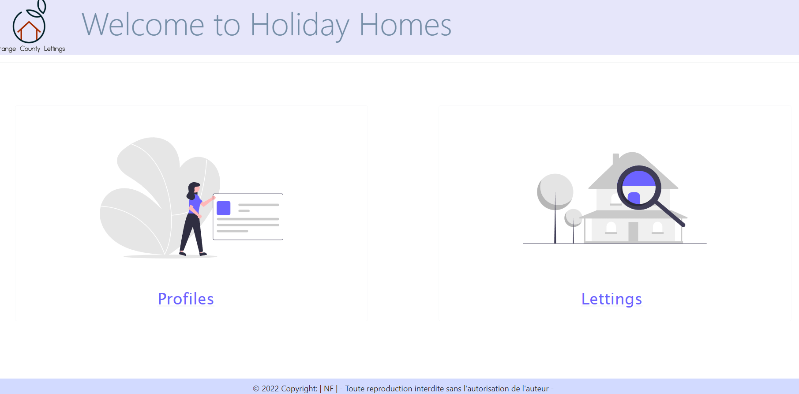

## Site web d'Orange County Lettings:

  

# Résumé
## Index
1. [Développement local](#d-veloppement-local)
2. [Développement local depuis DockerHub](#d-veloppement-local-depuis-dockerhub)
3. [Créer une imagen Docker](#cr-er-une-imagen-docker)
4. [Sentry](#sentry)
5. [Définissez vos propres variables d'environnement](#d-finissez-vos-propres-variables-d-environnement)
6. [Déploiement sur Heroku](#d-ploiement-sur-heroku)

---------------------------------------------------------------

## Développement local

### Prérequis

- Compte GitHub avec accès en lecture à ce repository
- Git CLI
- SQLite3 CLI
- Interpréteur Python, version 3.6 ou supérieure

Dans le reste de la documentation sur le développement local, il est supposé que la commande `python` de votre OS shell exécute l'interpréteur Python ci-dessus (à moins qu'un environnement virtuel ne soit activé).

### macOS / Linux

#### Cloner le repository

- `cd /path/to/put/project/in`
- `git clone https://github.com/OpenClassrooms-Student-Center/Python-OC-Lettings-FR.git`

#### Créer l'environnement virtuel

- `cd /path/to/Python-OC-Lettings-FR`
- `python -m venv venv`
- `apt-get install python3-venv` (Si l'étape précédente comporte des erreurs avec un paquet non trouvé sur Ubuntu)
- Activer l'environnement `source venv/bin/activate`
- Confirmer que la commande `python` exécute l'interpréteur Python dans l'environnement virtuel
`which python`
- Confirmer que la version de l'interpréteur Python est la version 3.6 ou supérieure `python --version`
- Confirmer que la commande `pip` exécute l'exécutable pip dans l'environnement virtuel, `which pip`
- Pour désactiver l'environnement, `deactivate`

#### Exécuter le site

- `cd /path/to/Python-OC-Lettings-FR`
- `source venv/bin/activate`
- `pip install --requirement requirements.txt`
- `python manage.py runserver`
- Aller sur `http://localhost:8000` dans un navigateur.
- Confirmer que le site fonctionne et qu'il est possible de naviguer (vous devriez voir plusieurs profils et locations).

#### Linting

- `cd /path/to/Python-OC-Lettings-FR`
- `source venv/bin/activate`
- `flake8`

#### Tests unitaires

- `cd /path/to/Python-OC-Lettings-FR`
- `source venv/bin/activate`
- `pytest`

#### Base de données

- `cd /path/to/Python-OC-Lettings-FR`
- Ouvrir une session shell `sqlite3`
- Se connecter à la base de données `.open oc-lettings-site.sqlite3`
- Afficher les tables dans la base de données `.tables`
- Afficher les colonnes dans le tableau des profils, `pragma table_info(Python-OC-Lettings-FR_profile);`
- Lancer une requête sur la table des profils, `select user_id, favorite_city from
  Python-OC-Lettings-FR_profile where favorite_city like 'B%';`
- `.quit` pour quitter

#### Panel d'administration

- Aller sur `http://localhost:8000/admin`
- Connectez-vous avec l'utilisateur `admin`, mot de passe `Abc1234!`

### Windows

Utilisation de PowerShell, comme ci-dessus sauf :

- Pour activer l'environnement virtuel, `.\venv\Scripts\Activate.ps1` 
- Remplacer `which <my-command>` par `(Get-Command <my-command>).Path`

-------------------------------------------------------------------

## Développement local depuis DockerHub

- Installer [Docker Desktop](https://www.docker.com/products/docker-desktop/) sur votre machine 
- Créer un compte [Docker Hub](https://hub.docker.com/)
- Pour charger l'image localement, dans la console, éxecuter: `docker run -p 8000:8000 appryll/oc-lettings-site`
- Aller sur l'adresse `http://127.0.0.1:8000/`

> #### Recuperer l'image souhaite : 
>C'est posible de récupérer l'image souhaité en copiant le nom de l'image et le tag associé. Ex : 'oc-lettings-site:663ef4f3666cf2f403fa246b308e43980cb7d6a3'
>Pour obtenir la liste des tags et utiliser le tag souhaité simplement sur votre dockerHub lancez la recherche suivante : 'appryll/oc-lettings-site' (username DockerHub/repository name). 

- Pour telecharger une image, dans la console, éxecuter: `docker pull <DOCKERHUB_USERNAME>/<IMAGE_NAME>:<tag>` . Ex : `docker pull appryll/oc-lettings-site:907d8aab31da99f105773a26c34e072d0c44b9eb`
-------------------------------------------------------------------

## Créer une imagen Docker

- Installer [Docker Desktop](https://www.docker.com/products/docker-desktop/) sur votre machine 
- Créer un compte [Docker Hub](https://hub.docker.com/)
- Dans le terminal, au racine du projet, éxecuter: `docker build -t <IMAGE_NAME> .` avec le nom d'image souhaité. _ATTENTION!! : n'oubliez pas le point (.) -> indique le dossier de reference_
- Utiliser la commande `docker images -a` afin de vérifier que l'image a été créée correctement
- Pour lancer  le conteneur, taper la commande `docker run <IMAGE_NAME>` 
- Pour arrêter le conteneur:
  - Tout d'abord il faut connaître l'ID du conteneur. Pour cela taper `docker ps` afin d'obtenir la liste des conteneurs
  - Copie l'ID
  - Dans le terminal, taper `docker stop <numero conteneur id>`
- Pour supprimer le conteneur, éxecuter la commande `docker rm <numero conteneur id>`

-------------------------------------------------------------------

## Sentry

- Créer un compte [Sentry](https://sentry.io/signup/)
- Se connecter à votre compte
- En accédant à [Project] > Créer un nouveau projet
- Garder le Data Source Name (DSN) afin de completer le fichier `.env`

  > ##### Plus d'info: [Docs Sentry -> Créer un nouveau projet Django](https://docs.sentry.io/product/accounts/getting-started/#4-create-projects)

-------------------------------------------------------------------

## Définissez vos propres variables d'environnement

Pour ce faire, créer un fichier `.env` et définir votre valeur de SECRET_KEY, de DEBUG et de DSN_SENTRY. Utiliser le fichier `.env.example` comme exemple (si vous le souhaitez, vous pouvez le compléter et le renommer en `.env`)

> ##### !! AVERTISSEMENT DE SÉCURITÉ : ne pas exécuter avec le débogage activé en production !

> DSN_SENTRY : Vous pouvez trouver le DSN dans les paramètres de votre projet en accédant à [Project] > Settings > Client Keys (DSN). 
> ##### Plus d'info: [Docs Sentry: Sentry Basics > Data Source Name (DSN)](https://docs.sentry.io/product/sentry-basics/dsn-explainer/)

--------------------------------------------------------------------

## Déploiement sur Heroku

Dans le cadre de l'intégration continue, le déploiement sur Heroku se fait automatiquement sur Circleci depuis une image docker via Github lors d'un push sur la branch master. À cette fin, certaines configurations sont nécessaires:

### - Configuration sur Heroku

- Créer un compte [Heroku](https://signup.heroku.com/)
- Créer une nouvelle application vide sur Heroku:
    - via la commande `heroku create <HEROKU_APP_NAME>` sur votre terminal
        
        ou 

    - via Heroku web en accédant à Dashboard > New > Create new app

### - Configuration sur Circleci

- Créer un compte [Circleci](https://circleci.com/signup/)
- Se connecter à votre compte, sélectioner une organisation, configurer le projet (suivre un projet) et sélectioner la branch master
- En accédant à [Projet] > Project Settings > Environment Variables > Add Environment Variable 

  Ajouter et définir les variables d'environnement suivantes:

      > DOCKERHUB_PASSWORD 
      > DOCKERHUB_USERNAME
      > HEROKU_API_KEY
      > HEROKU_APP_NAME
      > IMAGE_NAME
      > DSN_SENTRY
  
  > HEROKU_API_KEY :  Vous pouvez afficher votre clé API Heroku en allant sur Account settings> API Key> Reveal

### L'execution du pipeline est déclenchée automatiquement via Github lors d'un push sur la branch master, donc il vous reste simplement faire un commit.
 